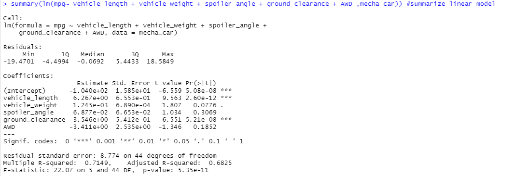
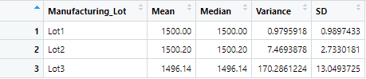
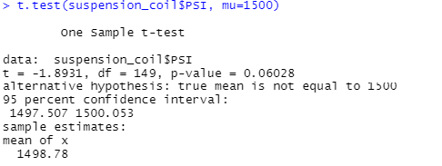
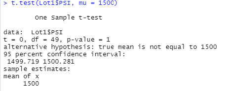
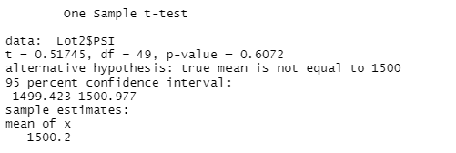
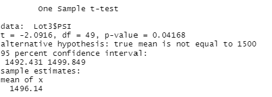

# MechaCar Statistical Analysis

### Linear Regression

- Vehicle length and ground clearance would provide a non random amount of variance to the mpg values in the dataset.
- The p-value of the summary is 5.35e-11, which is lower than the assumed significance level, so we would reject the null hypothesis.
- The linear model seemingly effectively predicts mpg of MechaCar protoypes because the Multple R squared value equates to about 71%.

### Suspension Coil Summary

- The current manufacturing data meets the design specifications on only Lots 1 and 2. Lot 3, however exceeds a PSI of 100. Lot 3 has a PSI variance of 170.
### T-Tests

### Final Summary